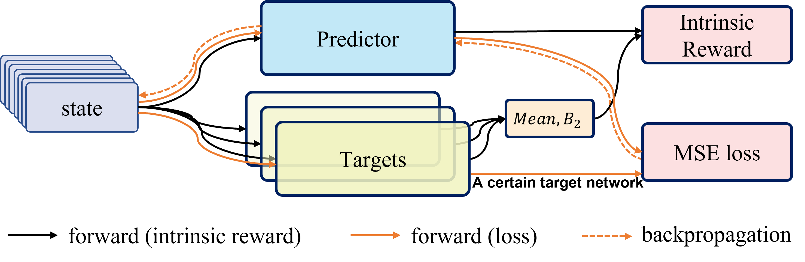

# Distributional Random Network Distillation (DRND)
Code for ICML 2024 paper "Exploration and Anti-exploration with Distributional Random Network Distillation".



# 1. Setup
To begin, create a conda environment and activate it using the following commands:
```
conda env create -f environment.yaml
conda activate drnd
```

# 2. Training
## 2.1 Running Offline Experiments
Quick start by running the following code:
```
cd offline
sh train.sh
```
If you need to run other datasets with different hyperparameters, here is an example:
```
sh train.sh --env_name walker2d --dataset_name walker2d_medium  --actor_lambda 10.0 --critic_lambda 10.0
```

## 2.2 Running Online Experiments
If you want to run Atari Game environments, run:
```
cd online
python train.py
```
# Citation
```
@article{yang2024exploration,
  title={Exploration and Anti-Exploration with Distributional Random Network Distillation},
  author={Yang, Kai and Tao, Jian and Lyu, Jiafei and Li, Xiu},
  journal={arXiv preprint arXiv:2401.09750},
  year={2024}
}
```
